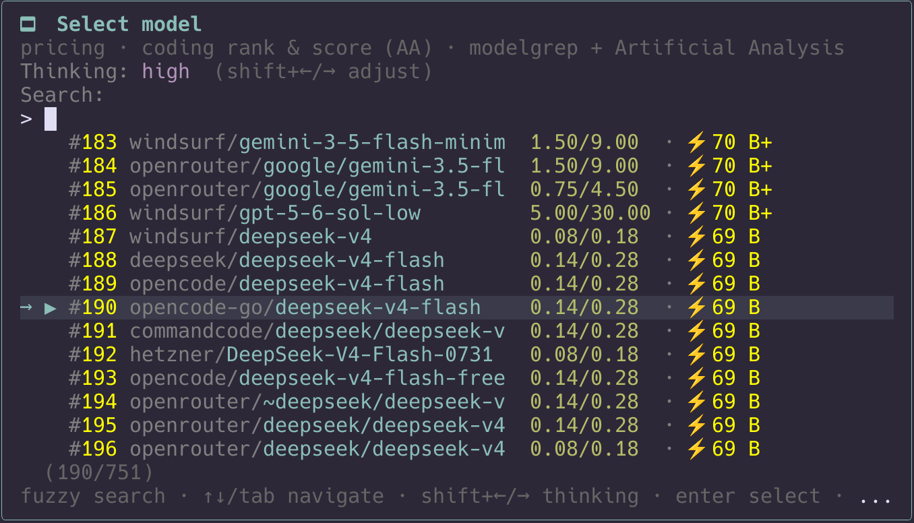

# pi-better-models

A Pi extension that replaces the basic model picker with a searchable `/models` picker built for choosing coding models.



## What you get

- Artificial Analysis **Coding Index** score and letter grade (`A+` to `F`)
- Local rank among the models available in your current Pi session
- Routing provider shown for every model
- Input/output pricing
- Optional context-window display
- Fuzzy search
- `Tab` / `Shift+Tab` model cycling
- `Shift+←` / `Shift+→` thinking-level control
- Full-width selected-row highlighting
- `/models` command plus `Ctrl+L` model-picker integration

## Install

The package is not published on npm yet. Use the GitHub install for now:

```bash
pi install git:github.com/ktappdev/pi-better-models
```

Once published, the npm install will be:

```bash
pi install npm:pi-better-models
```

[NPM package page](https://www.npmjs.com/package/pi-better-models) · [GitHub repository](https://github.com/ktappdev/pi-better-models)

## How the score works

The picker uses the **Artificial Analysis Coding Index**, a 0–100 coding-focused score:

1. It first reads `benchmarks.artificial_analysis.coding` from [modelgrep](https://modelgrep.com).
2. If modelgrep has no coding score, it uses the first-party Artificial Analysis API when an API key is configured.
3. If neither source has a coding score, the model is shown as unscored.

There is no intelligence-score rescaling or custom heuristic. The displayed rank is calculated locally across your available, scored models.

Grades are calibrated to the current Coding Index range:

```text
80+ A+   76–79 A    73–75 A−   70–72 B+
67–69 B  64–66 B−   61–63 C+   58–60 C
55–57 C− 50–54 D    <50 F
```

## Optional first-party AA fallback

Modelgrep works without a key. To fill coding-score gaps with Artificial Analysis’s first-party data, set a free API key:

```bash
export ARTIFICIAL_ANALYSIS_API_KEY=aa_xxx
```

`AA_API_KEY` is also accepted as an alias. Restart Pi after changing the environment.

## Choose the row details

The default compact row shows pricing and rating:

```text
pricing · coding rank & score (AA)
```

Use `PI_MODELS_COLUMNS` to choose from `context`, `pricing`, and `score`:

```bash
# Default
export PI_MODELS_COLUMNS=pricing,score

# Show all fields
export PI_MODELS_COLUMNS=context,pricing,score

# Context and rating only
export PI_MODELS_COLUMNS=context,score
```

## License

MIT © Ken Taylor
